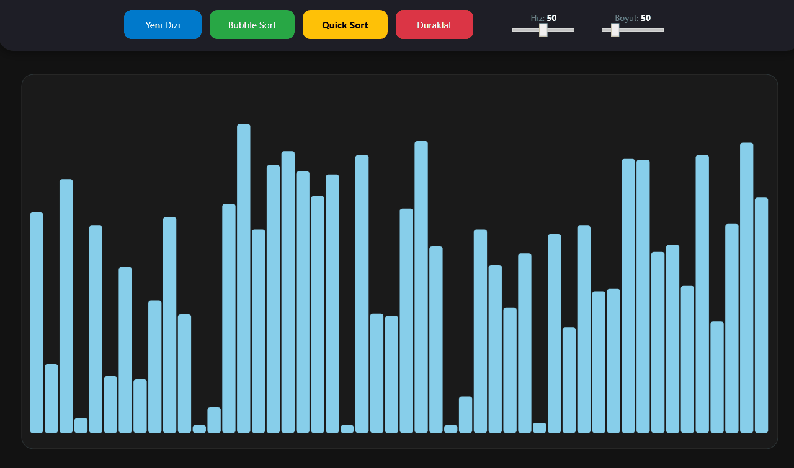

# VisualSort Algorithm Visualizer (WPF)

## 🇹🇷 Proje Hakkında (Türkçe)

**VisualSort**, C# ve WPF (Windows Presentation Foundation) kullanılarak geliştirilmiş, popüler sıralama algoritmalarını görselleştiren interaktif bir masaüstü uygulamasıdır. 

Bu proje, bir Bilgisayar Mühendisliği 2. sınıf öğrencisi olarak "Veri Yapıları ve Algoritmalar" dersinde edindiğim teorik bilgileri pratiğe dökmek ve modern yazılım geliştirme tekniklerini (Async/Await) uygulamak amacıyla geliştirilmiştir. Ulusal Staj Programı (USP) başvurusu için özel olarak tasarlanmıştır.

### Öne Çıkan Özellikler

* **Algoritmalar:** Hem basit (Bubble Sort) hem de gelişmiş (Quick Sort - Divide and Conquer) algoritmaları destekler.
* **İnteraktif Kontrol:** Kullanıcı, dizinin boyutunu (10 - 150 eleman) ve sıralama hızını gerçek zamanlı olarak değiştirebilir.
* **Duraklat/Devam Et:** Sıralama işlemi istenildiği zaman duraklatılabilir ve kaldığı yerden devam ettirilebilir.
* **Görsel Geribildirim:** Karşılaştırılan elemanlar **Kırmızı**, sıralanmış dizi **Yeşil** renk ile anlık olarak vurgulanır.
* **Performans:** Async/Await yapısı sayesinde arayüz donmadan akıcı bir animasyon sunar.

### Kullanılan Teknolojiler

* **Dil:** C#
* **UI Çerçevesi:** WPF (XAML)
* **Teknikler:** Asenkron Programlama (Async/Await), Threading, Recursion (Quick Sort için).

---

## 🇺🇸 About the Project (English)

**VisualSort** is an interactive desktop application developed using C# and WPF to visualize popular sorting algorithms step-by-step. 

I developed this project as a sophomore Computer Engineering student to bridge the gap between theoretical knowledge gained in "Data Structures and Algorithms" courses and practical application. It implements modern software development techniques, such as async/await, to provide a smooth user experience. This project is showcasing my technical skills for the National Internship Program (USP).

### Key Features

* **Supported Algorithms:** Visualizes both iterative (Bubble Sort) and recursive, advanced (Quick Sort - Divide and Conquer) algorithms.
* **Live User Control:** Users can change the array size (10 - 150 elements) and animation speed in real-time.
* **Pause/Resume:** The sorting process can be paused at any point and resumed from where it left off.
* **Visual Feedback:** Active elements during comparison are highlighted in **Red**, and the sorted array is marked in **Green**.
* **Performance:** Fluid animations are achieved through async/await, keeping the UI responsive.

### Technologies Used

* **Language:** C#
* **UI Framework:** WPF (XAML)
* **Techniques:** Asynchronous Programming (Async/Await), Threading, Recursion (for Quick Sort).
